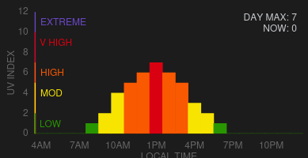

# Hourly UV Index Card

## Install instructions

### Recommended: Install with HACS

1. Ensure you have installed https://github.com/davidn/epa_uvindex first.

2. Navigate to the HACS add-on. Go to "Frontend", if HACS has separate pages for Integrations and Frontend.

2. Via the "..." menu at the top right, select "Custom repositories" and add https://github.com/davidn/uvindex-hourly as type "Lovelace" (or "Plugin", if you are on older HACS versions).

3. If there is a "Explore & download respositories" button, click on it and find "Hourly UV Index Card". If you directly see a list of cards, find "Hourly UV Index Card" (you may need to clear filters to see integrations that haven't been downloaded). Click on it and then click "Download".

4. When you are prompted to reload the frontend, do so.

### Manual Install

1. Copy `dist/uvindex-hourly.js` in this repository to `/homeassistant/www/community/uvindex-hourly`.

2. Refresh your browser (Clearing cache).

## Usage

Select "Custom: Hourly UV Index Card" when adding a card to the dashboard. Ensure the entity references one from the epa_uvindex integration.

### Options

| Name              | Type    | Requirement  | Description                                 | Default             |
| ----------------- | ------- | ------------ | ------------------------------------------- | ------------------- |
| type              | string  | **Required** | `custom:uvindex-hourly`                   |
| entity            | string  | **Optional** | Home Assistant entity ID. Must be an `epa_uvindex` sensor.                   | `none`              |
